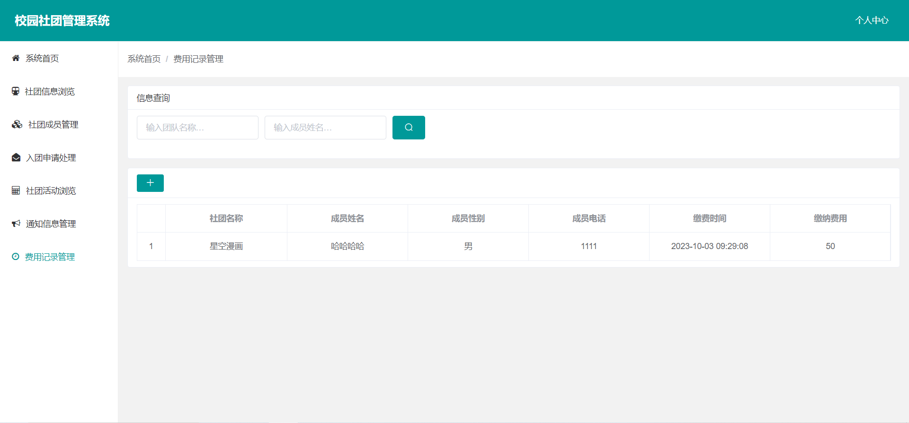

# 基于SpringBoot的高校社团管理系统 

（源代码+12000字文档+ppt）

## 项目简介

基于SpringBoot的高校社团管理系统，是一套多角色的社团管理系统，包含了管理员、社团团长、社团成员三种角色。 
管理员对社团信息和系统通知进行管理。 
社团团长可以处理入团申请、发布社团公告、管理社团成员、缴纳社团费用、发布社团活动等。 
社团团员可以浏览各个社团信息、申请加入社团、查看社团活动、查看缴费记录等。 
本系统是一套前后端分离的系统，前端使用vue+elementui，后端使用springboot框架。数据库使用的是mysql数据库。 
该系统功能完善，界面美观，非常适合作为毕设或者课程作业以及新手开发学习。 

## 视频介绍
<a href="https://www.bilibili.com/video/BV1Pp4y1F7nY/?spm_id_from=333.999.0.0" target="_blank">点击查看B站视频介绍</a>

## 功能介绍
 

## 技术服务

## 系统图片
#### 1.登录页面
 
#### 2.管理首页
 
#### 3.社团信息管理
 
#### 4.社团成员管理
 
#### 5.入团申请记录
 
#### 6.通知信息管理
 
#### 7.费用记录管理
 

